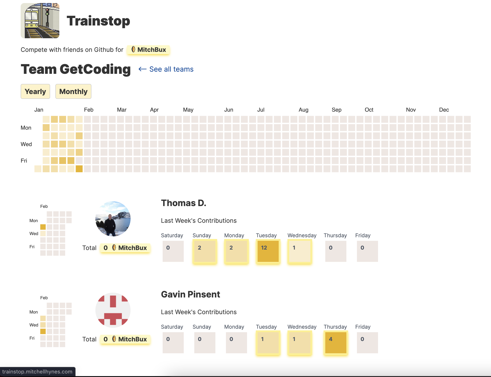

# TrainStop



https://trainstop.mitchellhynes.com/

Compete with friends on GitHub for MitchBux

## Running Locally

1. Install [Deno](https://deno.land/)

2. Get a [Github PAT](https://docs.github.com/en/authentication/keeping-your-account-and-data-secure/creating-a-personal-access-token)

> - This is required to use the GitHub API to fetch users via GraphQL, not something that can be done without authentication.
>
> - The PAT doesn't require any scopes.

3. Write your PAT to `scripts/.env`

```.env
GITHUB_TOKEN=your-pat-here
```

4. `cd scripts`, and run the script with `./run.sh`

5. Install packages: `npm install`

6. Run the development server: `npm run dev`

7. Visit `http://localhost:8080`!
